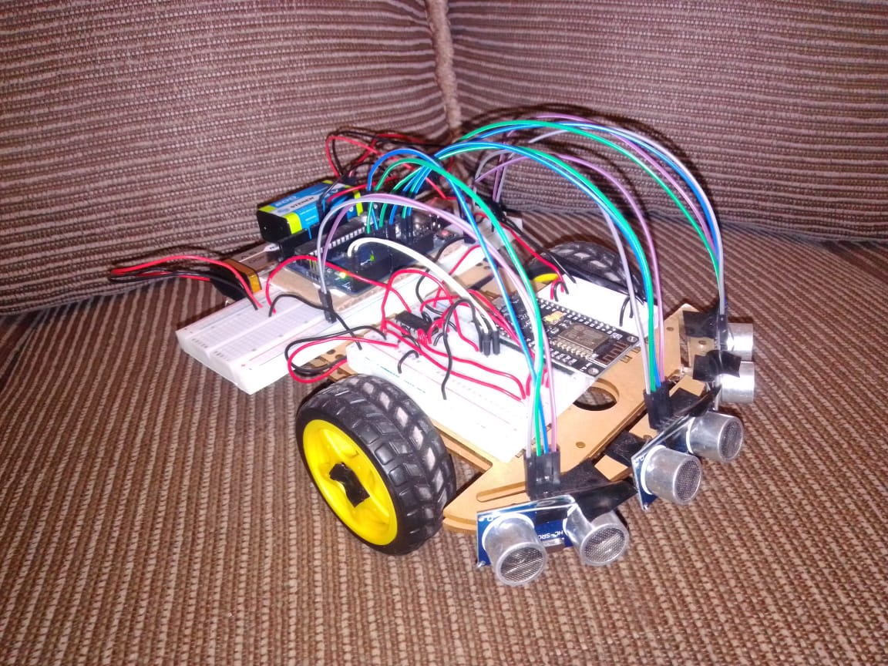
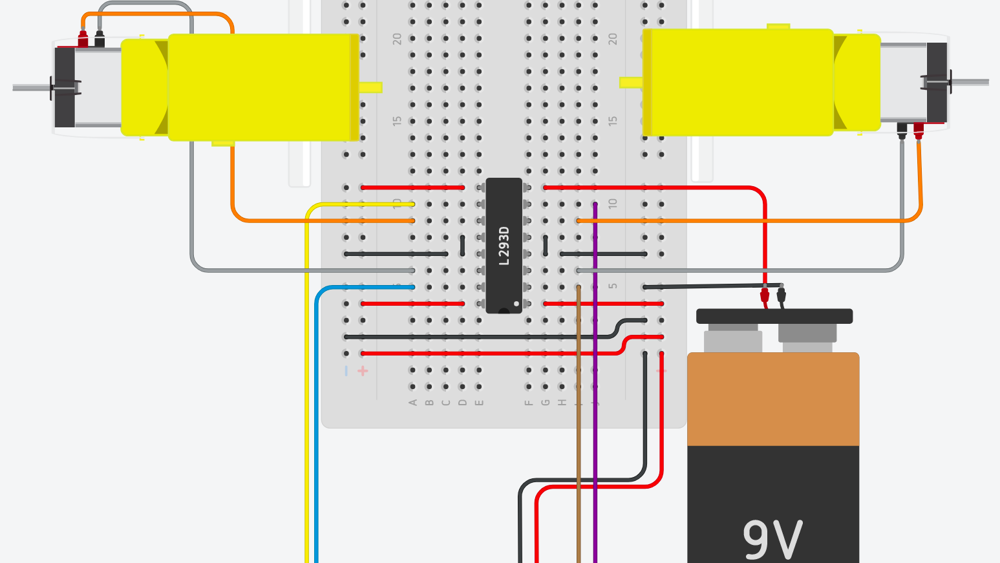
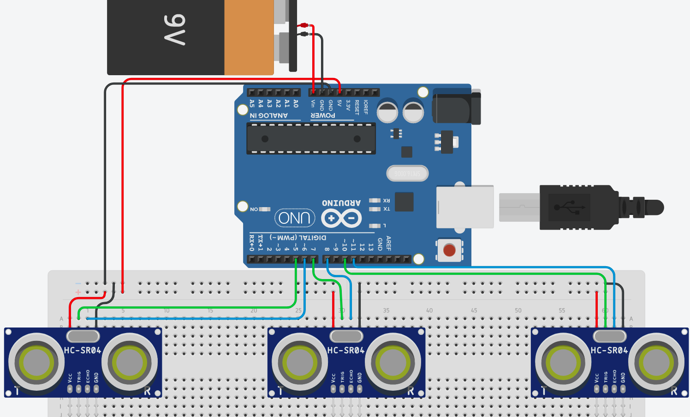

# Mark Rover I

Mark Rover I es un sistema desarrollado en Arduino que permite el control a distancia de un vehículo desde cualquier lugar del mundo mediante una conexión a Internet; 
además, cuenta con la autonomía para esquivar obstáculos. Es un proyecto que combina la electrónica con el aprendizaje automático y el internet de las cosas, 
cuyas aplicaciones se extienden desde la vigilancia y exploración, hasta los sistemas de conducción de vehículos autónomos.

## Hardware Necesario

* Chasis de carro de dos llantas: Para el posicionamiento de todos los componentes físicos del sistema.
* Dos motorreductores de 6V (Incluidos en el chasis): Para el movimiento del vehículo.
* Protoboards: Para realizar las conexiones entre los componentes electrónicos.
* Tres sensores ultrasónicos HC-SR04: Para la detección de obstáculos, distribuidos a lo ancho de la parte frontal del chasis.
* Arduino Uno: Para el control de los sensores ultrasónicos y ejecución de la red neuronal.
* Módulo NodeMCU Esp8266: Para la conexión a Internet y gestión de los dos motorreductores.
* Chip L293D (Puente H): Para el suministro de energía a los dos motorreductores.
* Tres baterías de 9V: Una para alimentar el Arduino Uno, otra para alimentar el módulo NodeMCU Esp8266 y una más para alimentar ambos motorreductores.

## Circuitos Necesarios

El sistema consta de dos circuitos principales:

### Circuito para el control de los motores (Módulo NodeMCU Esp8266)

Para suministrar el voltaje a los pines que hacen girar los motores, los conectaremos al módulo NodeMCU Esp8266 de la siguente manera:

* Cable café ---> pin 2 (D4/GPIO02)
* Cable morado ---> pin 0 (D3/GPIO00)
* Cable amarillo ---> pin 5 (D1/GPIO05)
* Cable azul ---> pin 4 (D2/GPIO04)

El chip L293D se alimentará, mediante su pin 1, con los 5V suministrados por el Arduino Uno.

### Circuito para el control de los senores ultrasónicos (Arduino Uno)

### Integración de los circuitos

La placa Arduino Uno debe comunicarse con el Módulo NodeMCU Esp8266 ya que al activarse la opción de piloto automático sucederá lo siguiente:

1. El módulo se pondrá en contacto con el Arduino para solicitarle una acción.
2. El Arduino recibirá la señal, obtendrá la información de los sensores y calculará una acción mediante la red neuronal, finalmente la enviará como respuesta al módulo.
3. El módulo recibirá del Arduino la acción calculada por la red neuronal y realizará la acción correspondiente generando una diferencia de potencial en los pines del chip L293D para que los motores giren hacia adelante, hacia atrás, o no se muevan.

Para lograr este objetivo establecemos una conexión alámbrica serial entre el Arduino Uno y el Módulo NodeMCU Esp8266 conectando entre sí sus pines Tx y Rx (responsables de la comunicación en serie) de forma cruzada; es decir, el pin Tx del Arduino se conectará al pin Rx del módulo, y el pin Rx del Arduino se conectará al pin Tx del módulo.

Finalmente, necesitamos tener una conexión a Tierra en común entre la GND del Arduino, la del módulo NodeMCU Esp8266, la del chip L293D y la de cada una de las baterías.

## Carga del Software

1. Nuestro sistema necesita una comunicación concurrente con un servidor web desde donde extraerá la acción a ejecutar. El primer paso es
**Configurar un servidor web y cargar los archivos y la base de datos contenidos en la carpeta [*servidor*](https://github.com/Pedro-Hdez/MarkRoverI/tree/master/servidor)**.

2. Cargar el archivo [sensores_y_red_neuronal.ino](https://github.com/Pedro-Hdez/MarkRoverI/blob/master/microcontroladores/sensores_y_red_neuronal/sensores_y_red_neuronal.ino) a la placa Arduino Uno

3. Cargar el archivo [movimiento_wifi.ino](https://github.com/Pedro-Hdez/MarkRoverI/blob/master/microcontroladores/movimiento_wifi/movimiento_wifi.ino) al Módulo NodeMCU Esp8266

## Entrenamiento de la red neuronal **(Opcional)**

Si se desea reentrenar la red neuronal:
1. Ejecutar el script [entrenamiento.py](https://github.com/Pedro-Hdez/MarkRoverI/blob/master/entrenamiento.py)

2. Copiar la salida del script en el archivo [sensores_y_red_neuronal.ino](https://github.com/Pedro-Hdez/MarkRoverI/blob/master/microcontroladores/sensores_y_red_neuronal/sensores_y_red_neuronal.ino)

## Recursos adicionales

* Consultar el [Desarrollo del proyecto](https://drive.google.com/file/d/1CgL-m6Xf-vCdh7g9XYtH9Jat35hXKd-Q/view?usp=sharing) para una mejor explicación del mismo.
* [Aquí](https://drive.google.com/file/d/1jBaRuyCzt3rDAo4bRxy01-T76NiVs_aa/view?usp=sharing) una pequeña demostración.
